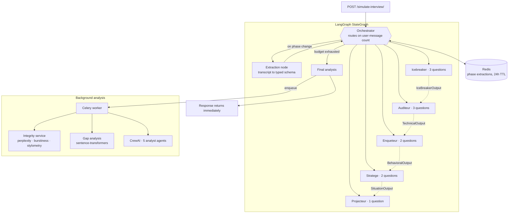

# RONI Interview Simulation API

Stateful multi-agent interview engine. A LangGraph state machine runs a five-phase interview with a fixed question budget, each phase handing the next a typed summary of what it found. Scoring is deterministic Python, not model output.

`Python 3.11` · `LangGraph` · `LangChain` · `CrewAI` · `FastAPI` · `Celery` · `Redis` · `Transformers` · `Langtrace`

---

## What it does

Given a parsed CV and a job offer, the service conducts a structured interview turn by turn, then produces a scored evaluation covering technical depth, behavioural signals, situational judgment, and answer-integrity flags.

It is one microservice inside a larger recruitment platform: the orchestration backend owns identity, billing, and persistence, and calls this service for the conversation.

---

## Architecture



---

## Engineering decisions

### The orchestrator is deterministic, the agents are not

An LLM deciding when to move on is an LLM deciding how much your interview costs. It can loop, stall on one topic, or end after two questions.

Routing here is a pure function of the count of candidate messages so far, against a fixed per-agent budget:

```python
QUESTIONS_PER_AGENT = {
    "icebreaker": 3, "auditeur": 3, "enqueteur": 2,
    "stratege": 2, "projecteur": 1,
}
```

Every interview is exactly 11 candidate turns. Cost per interview is known before it starts, duration is predictable for the candidate, and every session covers the same ground, which is what makes candidates comparable at all. The model chooses what to ask. It does not choose whether to keep going.

### Phases pass structured findings, not raw transcript

Feeding each agent the whole conversation grows the context every turn and forces each one to re-derive conclusions the previous agent already reached.

Instead, on each phase transition an extraction node distils the exchange into a typed Pydantic object, and the next agent receives that. The technical agent gets the icebreaker's profile classification. The behavioural agent gets the technical agent's identified skill gaps and score. The situational agent gets the behavioural findings to probe.

```
IceBreakerOutput -> TechnicalOutput -> BehavioralOutput -> SituationOutput -> SimulationReport
```

Context stays bounded, each phase builds on a verdict rather than re-reading evidence, and the intermediate structures are inspectable when a final score looks wrong.

### Scoring is deterministic Python, decoupled from the LLM

This is the core decision in the repository.

The model is never asked for a score. It is asked for binary observations about what the candidate demonstrated: did they explain the underlying concept, did they identify limitations, did they propose alternatives, did they quantify results. Those booleans go into pure weighted functions:

```python
weights = {
    "justifie_choix": 1, "fonctionnement_interne": 3,
    "identifie_limites": 2, "propose_alternatives": 2,
    "quantifie_resultats": 1, "resolution_probleme": 2,
}
# 0-2 -> 1/5, 3-4 -> 2/5, 5-6 -> 3/5, 7-9 -> 4/5, 10-11 -> 5/5
```

Three consequences that matter for a product that ranks people:

- **Reproducible.** The same observations always yield the same score. LLM-generated numbers drift between calls at identical temperature.
- **Auditable.** A candidate's 3/5 decomposes into named criteria. "The model said so" does not survive a challenge.
- **Tunable.** Changing what the product values is a weight edit, not a prompt rewrite and re-evaluation.

The model does what it is good at, reading language. Arithmetic stays in code.

### Integrity signals from statistical text properties

Candidates pasting model output is the obvious failure mode for a remote interview product. Three independent signals are computed on the transcript:

| Signal | Method | Interpretation |
|---|---|---|
| Perplexity | Sliding-window over DistilGPT2, 512 stride | Low perplexity means predictable text |
| Burstiness | Variance in sentence length | Human writing varies, generated text is even |
| Stylometric gap | Flesch readability and type-token ratio, transcript against CV | Same person, wildly different register |

These combine into a weighted suspicion score with named reasons attached. It is reported as a signal for a human to weigh, never as a verdict, and never as an automatic rejection. False positives on non-native speakers and on candidates who write formally are a known limitation, which is exactly why the output is advisory.

### Analysis is asynchronous

The final turn returns a closing message immediately. The heavy work (a five-agent CrewAI analysis, two transformer models, semantic gap analysis) is enqueued to Celery with three retries and exponential backoff.

The candidate is not held on an open HTTP connection while a model ensemble runs, and a failed analysis retries instead of losing the interview.

The graph also produces a report inline where it can. When that succeeds, the CrewAI path is skipped entirely and only the integrity pass runs, which removes five agent calls from the common case.

### Only the derived state is persisted

Redis holds the phase extractions and routing context under a 24 hour TTL. The transcript itself is not stored here; the calling service owns it.

HTTP stays stateless and horizontally scalable, conversation state survives across requests, and this service holds the minimum personal data needed to do its job.

### Grounding before judging

Before the analyst agents run, a search service classifies the role (data engineer, scientist, or analyst) and checks the CV for production-grade action verbs matched to that role: deploy, monitor, industrialise, scale for engineering; train, fine-tune, evaluate, benchmark for science.

The difference between listing a technology and having run it in production is usually visible in the verbs. Feeding that gap analysis into the agents grounds their judgment in something checkable instead of leaving them to infer seniority from vibes.

### Heavy models are singletons, loaded lazily

DistilGPT2 and all-MiniLM-L6-v2 load once per process, on first use, behind a singleton. Cold start stays fast, and a request that never touches integrity analysis never pays for the model.

---

## The five interviewers

| Agent | Turns | Role |
|---|---|---|
| **Icebreaker** | 3 | Establishes profile type. Branches on career-changer, student, or standard track, and adapts to internship versus permanent role |
| **Auditeur** | 3 | Technical depth against claimed skills and projects, probing for underlying understanding rather than tool familiarity |
| **Enqueteur** | 2 | Behavioural signals, informed by the gaps the technical phase surfaced |
| **Stratege** | 2 | Situational judgment scenarios built from the actual job mission |
| **Projecteur** | 1 | Forward projection into the role |

Prompts live as editable text files in `src/prompts/`, outside the code path, so interview behaviour can change without a code review.

---

## API

```bash
curl -X POST http://localhost:7860/simulate-interview/ \
  -H "Content-Type: application/json" \
  -d '{
    "user_id": "...",
    "job_offer_id": "...",
    "cv_document": { "candidat": { } },
    "job_offer": { "poste": "...", "mission": "...", "competences": "..." },
    "messages": [{"role": "user", "content": "Bonjour"}]
  }'
```

```json
{ "response": "...", "status": "interviewing | interview_finished" }
```

The caller replays the full message history each turn; phase state is recovered from Redis by `user_id`. Payload schemas are documented in `documentation/`.

---

## Running it

```bash
docker build -t roni-interview .
docker run -p 7860:7860 --env-file .env roni-interview
```

The image runs as a non-root user and pre-downloads NLTK and TextBlob corpora at build time so the first request does not pay for them. `start.sh` runs the Celery worker alongside Uvicorn.

Locally:

```bash
pip install -r requirements.txt
celery -A src.celery_app worker --loglevel=info &
uvicorn main:app --reload --port 7860
```

Requires `OPENAI_API_KEY`, `REDIS_URL`, and `BACKEND_API_URL`. Traces are exported to Langtrace over OpenTelemetry.

---

## Layout

```
main.py                          FastAPI app, single endpoint
src/services/graph_service.py    LangGraph state machine, orchestrator, agent nodes
src/services/simulation/
    agents.py                    Structured extraction from transcript
    schemas.py                   Typed phase outputs
    scoring.py                   Deterministic weighted scoring
src/services/integrity_service.py  Suspicion scoring from NLP metrics
src/services/nlp_service.py        Perplexity, burstiness, lexical diversity
src/services/semantic_service.py   Sentence-transformer similarity
src/services/search_service.py     Role classification and gap analysis
src/services/feedback_crew.py      CrewAI fallback analysis, 5 agents
src/prompts/                       Agent prompts as editable text
src/tasks.py, src/celery_app.py    Background analysis queue
```

---

## Known limitations

- **The endpoint is unauthenticated.** The service is deployed on a private network and expects to be reached only through the orchestration backend, but it does not verify the `X-Internal-API-Key` header the backend sends. Enforcing it is the top open item.
- **Rate limiting keys on client IP**, which collapses to a single bucket when all traffic arrives from one upstream service. It needs to key on `user_id` from the payload.
- **Redis session keys omit the job offer**, so a candidate interviewing for two roles at once would share phase state across both.
- **Dependencies are unpinned.** The image is reproducible in shape, not in version.
- **The files under `tests/` are exploratory scripts**, not a runnable pytest suite.
